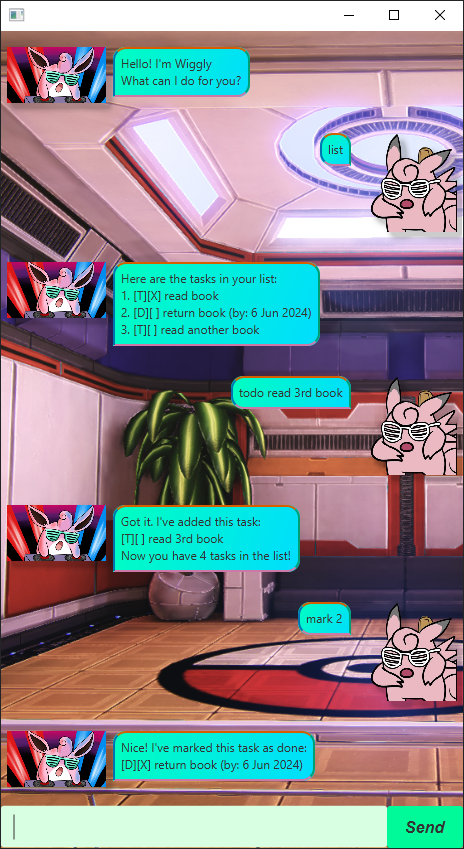

# Wiggly User Guide



## Introduction
Wiggly is a task management application that helps you keep track of your tasks, deadlines, and events. It provides a simple and intuitive interface to manage your daily activities efficiently.

## Table of Contents
- [**Getting Started**](#getting-started)
- [**Features**](#features)
    1. [**Add ToDo**](#adding-todo)
    2. [**Adding Deadline**](#adding-deadline)
    3. [**Adding Event**](#adding-event)
    4. [**Listing Tasks**](#listing-tasks)
    5. [**Marking Task as Done**](#marking-tasks-as-done)
    6. [**Deleting Task**](#deleting-tasks)
    7. [**Finding Tasks**](#finding-tasks)
    8. [**Archiving Tasks**](#archiving-tasks)
    9. [**Exiting Wiggly**](#exiting-wiggly)
- [**FAQ**](#faq)

## Getting Started
1. **Prerequisites**: Ensure you have Java 17 or above installed on your computer.
2. **Download and Install**: Download the latest version of Wiggly from the [release page](https://github.com/amoschee/ip/releases).
3. **Run the Application**: Double-click the downloaded file to run the application.
4. **Start Adding Tasks**: Use the commands listed above to start managing your tasks.

## Features

### Adding ToDo

- **Description**: Adds a simple task without any date attached to it.
- **Usage**: `todo <task description>`
- **Example**: `todo Read a book`
- **Output**:
  ```
  Got it. I've added this task:
      [T][ ] Read a book
  Now you have 1 task in the list.
  ```
  
### Adding Deadline

- **Description**: Adds a task that needs to be done by a specific date.
- **Usage**: `deadline <task description> /by <date>`
- **Example**: `deadline Submit assignment /by 2023-10-10`
- **Output**:
  ```
  Got it. I've added this task:
      [D][ ] Submit assignment (by: 10 Oct 2023)
  Now you have 2 tasks in the list.
  ```
  
### Adding Event

- **Description**: Adds a task that starts at a specific date and ends at a specific date.
- **Usage**: `event <task description> /at <start date> to <end date>`
- **Example**: `event Team meeting /at 2023-10-10 14:00 to 2023-10-10`
- **Output**:
  ```
  Got it. I've added this task:
    [E][ ] Team meeting (at: 10 Oct 2023 to 10 Oct 2023)
  Now you have 3 tasks in the list.
  ```
### Listing Tasks

- **Description**: Lists all the tasks in your task list.
- **Usage**: `list`
- **Output**:
  ```
  Here are the tasks in your list:
  1. [T][ ] Read a book
  2. [D][ ] Submit assignment (by: 10 Oct 2023)
  3. [E][ ] Team meeting (at: 10 Oct 2023 to 10 Oct 2023)
  ```
  
### Marking Tasks as Done

- **Description**: Marks a task as done.
- **Usage**: `done <task number>`
- **Example**: `done 1`
- **Output**:
  ```
  Nice! I've marked this task as done:
      [T][X] Read a book
  ```
### Deleting Tasks

- **Description**: Deletes a task from your task list.
- **Usage**: `delete <task number>`
- **Example**: `delete 2`
- **Output**:
  ```
  Noted. I've removed this task:
      [D][ ] Submit assignment (by: 10 Oct 2023)
  Now you have 2 tasks in the list.
  ```
### Finding Tasks

- **Description**: Finds tasks that contain a specific keyword.
- **Usage**: `find <keyword>`
- **Example**: `find book`
- **Output**:
  ```
  Here are the matching tasks in your list:
  1. [T][X] Read a book
  ```
  
### Archiving Tasks
- **Description**: Archives all the tasks in your task list in a file named `archive.txt` in `./data` directory.
- **Usage**: `archive`
- **Output**:
  ```
  All tasks have been archived.
  ```
  
### Exiting Wiggly

- **Description**: Exits the application.
- **Usage**: `bye`
- **Output**:
  ```
  Bye. Hope to see you again soon!
  ```

## FAQ

### How do I save my tasks?

Your tasks are automatically saved to a file named `Wiggly.txt` in the `./data` directory.

### How do I load my tasks?

When you start the application, it automatically loads tasks from the `Wiggly.txt` file.